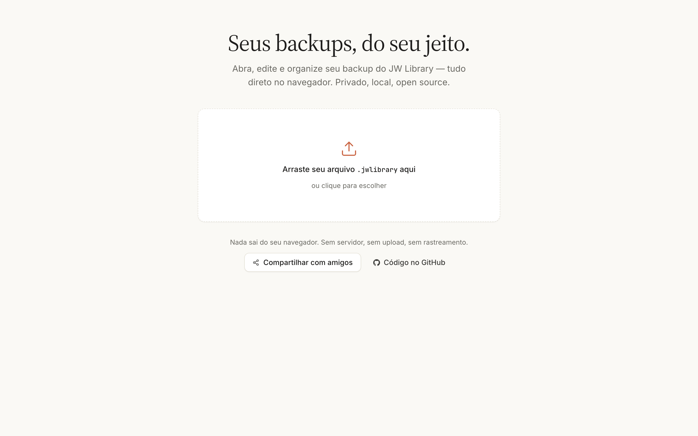
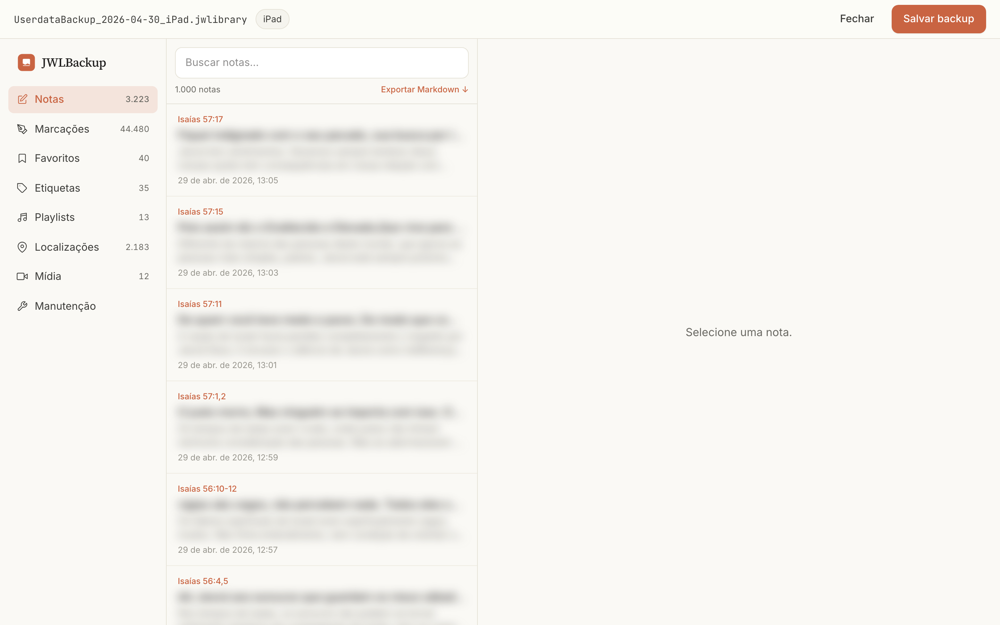
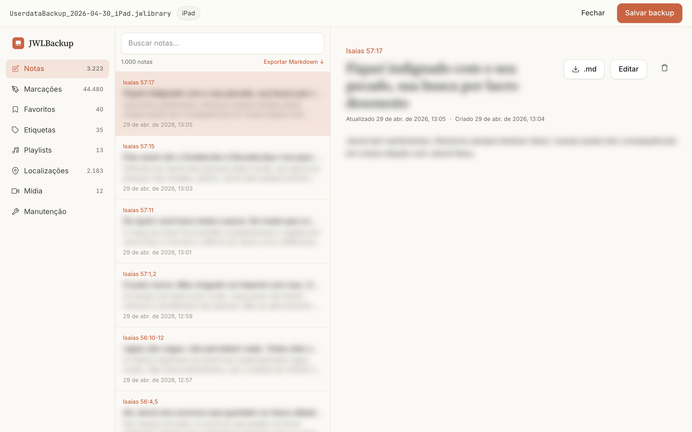
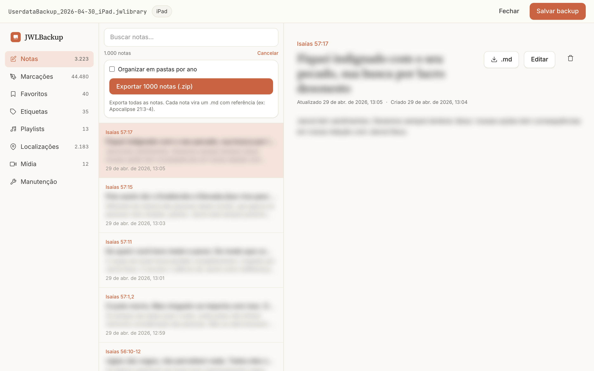
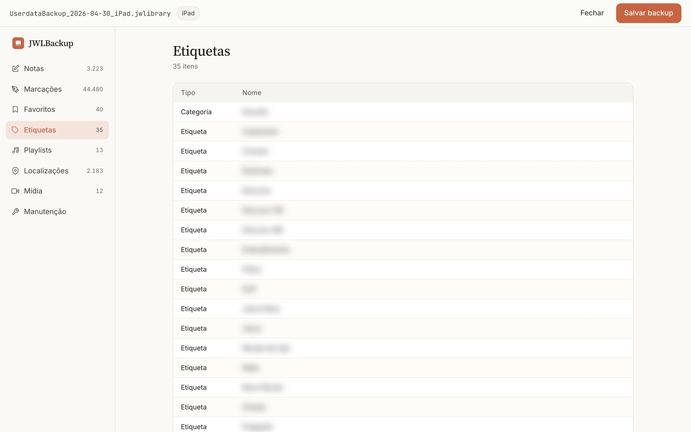
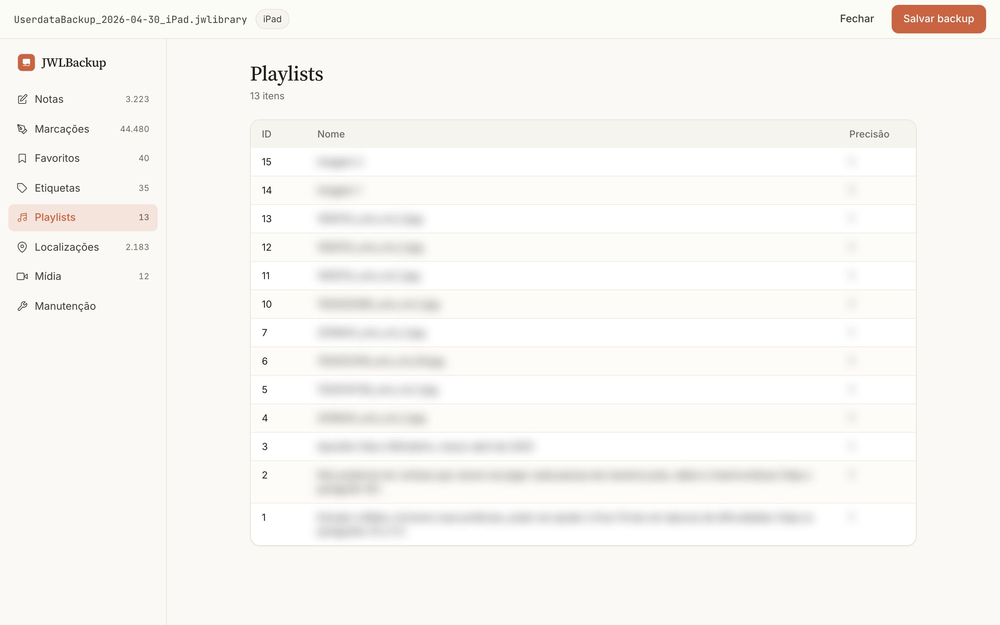
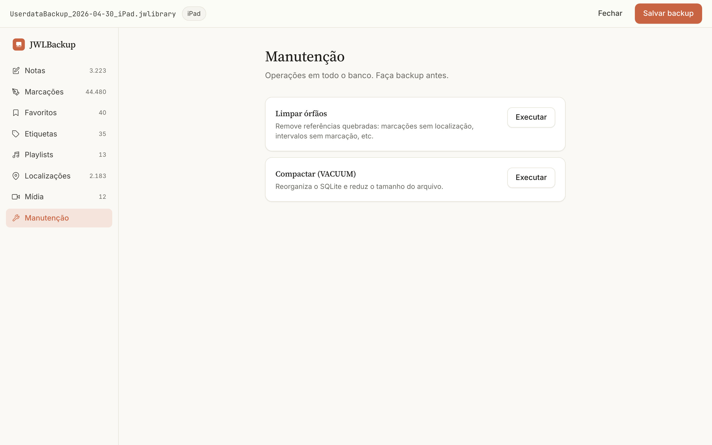

<!-- markdownlint-disable MD033 MD041 -->
<div align="center">


# JWLBackup

**Seus backups do JW Library, no navegador.**
Privado · local · open source.

[**🌐 Abrir o app →**](https://modilhao.github.io/jwlbackup/)

</div>

---

JWLBackup abre, edita e exporta arquivos `.jwlibrary` (backups gerados pelo *JW Library*) — sem servidor, sem upload, sem rastreamento. Tudo acontece dentro do seu navegador.

Funciona offline depois do primeiro acesso (PWA), pode ser **instalado como app** no celular ou desktop, e exporta suas notas para **Markdown** com referência exata da publicação — pronto pra cair no Obsidian.

## Galeria

<table>
<tr>
<td width="50%"></td>
<td width="50%"></td>
</tr>
<tr>
<td><sub><b>1.</b> Tela inicial. Arraste o arquivo ou clique pra escolher.</sub></td>
<td><sub><b>2.</b> Lista de notas. Cada uma mostra a referência exata em coral (<code>Isaías 57:15</code>, <code>Isaías 56:10-12</code>).</sub></td>
</tr>
<tr>
<td></td>
<td></td>
</tr>
<tr>
<td><sub><b>3.</b> Visualização e edição de uma nota. Botão <code>.md</code> exporta a nota individual.</sub></td>
<td><sub><b>4.</b> Exportar todas as notas para Markdown — uma por arquivo, com frontmatter pronto pro Obsidian.</sub></td>
</tr>
<tr>
<td></td>
<td></td>
</tr>
<tr>
<td><sub><b>5.</b> Etiquetas e categorias.</sub></td>
<td><sub><b>6.</b> Playlists.</sub></td>
</tr>
<tr>
<td></td>
<td valign="top">
<br />
<sub><b>7.</b> Manutenção: limpa registros órfãos e compacta o banco SQLite.<br /><br />Conteúdos pessoais nas screenshots foram desfocados de propósito — só as referências bíblicas (públicas) ficam nítidas.</sub>
</td>
</tr>
</table>

## Recursos

- **Drag & drop** de arquivos `.jwlibrary` (também aceita seletor)
- **Notas**: listar, buscar, ver, editar, excluir
- **Referências automáticas**:
  - Bíblia: `Apocalipse 21:3-4`, `Salmo 37:8-10`, `1 Coríntios 13:4,7`
  - Publicações: `w 26.01 par. 12`, `mwb par. 5`
- **Exportar para Markdown** (Obsidian-friendly):
  - Um `.md` por nota com frontmatter YAML completo
  - Filename inclui referência: `Apocalipse 21.3-4 — Título.md`
  - Opção de organizar em pastas por ano
  - `_Índice.md` com wikilinks
- Visualização de Marcações, Favoritos, Etiquetas, Playlists, Localizações, Mídia
- **Manutenção**: limpar registros órfãos, compactar SQLite (VACUUM)
- **Salvar de volta** como `.jwlibrary` válido (manifest + hash recomputados)
- **PWA**: instalável e offline-first
- **100% local**: SQLite WASM no navegador, nada vai pra servidor

## Compartilhar com amigos

Cole esse link em qualquer lugar — ele já vem com card preview no WhatsApp/Telegram:

```
https://modilhao.github.io/jwlbackup/
```

Ou no celular: abra o link no Safari/Chrome → menu → **"Adicionar à tela de início"** → vira um app nativo.

## Roadmap

- **v0.2** *(em andamento)*: edição de marcações e playlists; exportar XLSX/JSON
- **v0.3**: importar / mesclar backups
- **v0.4**: build desktop (Tauri) com sistema de arquivos nativo

## Desenvolvimento

```bash
bun install
bun run dev
```

Abra http://localhost:5173.

```bash
bun run build       # build estático em build/
bun scripts/screenshots.ts   # regenerar screenshots
```

## Stack

- SvelteKit 2 + Svelte 5 (runes) + TypeScript
- Tailwind CSS 4 (tema inspirado em Claude.ai)
- sql.js (SQLite compilado para WASM)
- fflate (ZIP em JS puro)
- Service Worker nativo do SvelteKit (offline-first)
- Hospedado em GitHub Pages

## Licença

[GPL-3.0](LICENSE) — copyleft. Contribuições bem-vindas via PR.

## Aviso

Este projeto não é afiliado, endossado ou patrocinado pela Watch Tower Bible and Tract Society. *JW Library* é marca registrada de seus respectivos donos. **Sempre mantenha cópia do arquivo original** antes de qualquer modificação.
